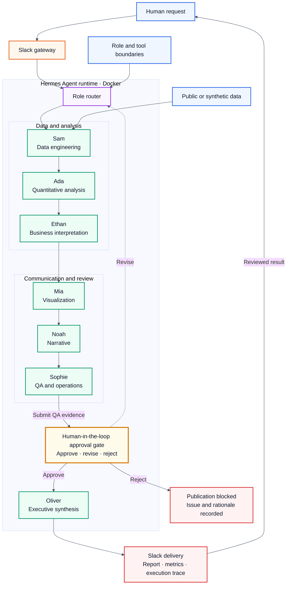

# Multi-Agent AI Analytics Office

**Language:** English | [日本語](japanese-readme.md)

[](https://github.com/Lee2379/multi-agent-ai-analytics-office/actions/workflows/ci.yml)


**A role-based AI office for research, governed data operations, analytics, review, and executive delivery—combining Hermes and Slack with Supabase/PostgreSQL and Obsidian/OhMyWiki inside a Dockerized operating model.**

This portfolio case study separates two things that are often mixed together:

1. **Operational evidence:** seven specialized Hermes profiles running in one bounded Docker deployment and serving work through Slack.
2. **Reproducible evaluation:** a deterministic, dependency-free Python harness that exercises the same role boundaries on synthetic data, produces an auditable trace, and is tested in CI.

No credentials, private messages, email/calendar data, workspace identifiers, or personal filesystem paths are published. Selected screenshots are either privacy-sanitized derivatives or low-sensitivity captures approved unchanged; private originals remain outside the repository.

## Executive summary

The prototype turns a general-purpose LLM runtime into a small virtual analytics office. A request is routed to agents with explicit responsibilities: data engineering, quantitative analysis, business interpretation, visualization, narrative, quality review, and final synthesis. Each stage emits a named artifact and a trace event instead of relying on an opaque group chat.

The live deployment demonstrated:

- seven isolated agent profiles with running gateways;
- Docker resource limits of 2 CPUs and 4 GiB memory;
- execution as the unprivileged `hermes` user;
- Slack delivery of a public-source market scan;
- role-specific work, including research, analysis, presentation generation, and operations support;
- an Obsidian-backed research workflow that preserved source provenance, structured concepts and relations, produced multilingual fact-checks, and delivered a source-linked 15-slide report; and
- a Supabase-backed data-operations loop spanning schema controls, role-separated ingestion, reconciliation, human-reviewed data quality, auditable SQL analysis, scheduled orchestration, and a deployed BI dashboard.

The public repository adds the missing engineering layer: deterministic data validation, leakage-safe holdout forecasting, artifact contracts, a QA gate, privacy scanning, tests, and a hardened offline container.

### Verification snapshot

| Control | Committed status |
|---|---:|
| Unit and integration tests | 12 / 12 passed |
| Deterministic reference artifacts | 6 / 6 matched |
| Reviewed evidence captures | 37 / 37 hashes verified |
| Internal documentation links | all local targets resolved |
| Hardened container smoke test | passed with network disabled and read-only root |

The detailed benchmark, test scope, statistical limitations, and release history are recorded in [`docs/evaluation.md`](docs/evaluation.md), [`docs/limitations.md`](docs/limitations.md), and [`CHANGELOG.md`](CHANGELOG.md). These checks validate the public engineering harness and evidence controls; they are not production-accuracy claims for the private Hermes deployment.

## Problem and design objectives

Market-research requests often combine source collection, data validation, quantitative analysis, interpretation, visualization, writing, and review in one unconstrained model interaction. That makes it difficult to identify where an error entered the workflow, which evidence supports a claim, or whether a final answer passed an independent check.

This project restructures that work around five design objectives:

1. **Role separation:** each specialist owns a bounded stage and an explicit output contract.
2. **Artifact-based handoffs:** metrics, charts, notes, verdicts, and reports move between stages as named artifacts rather than unstructured conversation history.
3. **Operational access:** Slack is the human-facing request and delivery surface; Hermes profiles provide specialist identities, policies, Skills, and tool access.
4. **Fail-closed review:** the final report is created only after data, forecast, chart, decision-note, and narrative checks pass.
5. **Reproducibility without disclosure:** the live deployment remains private, while a deterministic public harness reproduces the role sequence on synthetic data and emits reviewable outputs.

## Implementation model

The repository documents one system through two deliberately separate layers. Operational screenshots establish that the configured profiles were used in Docker and Slack; executable code establishes how the analytical contracts, evaluation logic, and QA gate behave. Neither layer is presented as a substitute for the other.

| Dimension | Live operational layer | Public reference layer |
|---|---|---|
| Runtime | Hermes Agent in one bounded Docker deployment | Python 3.11+ package and hardened offline container |
| Entry point | Slack mentions routed through profile gateways | `agentic-office run` CLI |
| Specialization | Seven Hermes profiles with profile-scoped identity, policy, Skills, and Slack configuration | Seven machine-readable contracts in [`config/agents.json`](config/agents.json) |
| Data access | Approved profile tools, Supabase Skill/MCP access, and optional public-source integrations | Synthetic CSV inputs; no network or external credentials |
| Coordination | Direct specialist routing for live work | Deterministic seven-stage artifact pipeline for evaluation |
| Outputs | Slack research reports and work products | JSON metrics and trace, SVG chart, Slack payload preview, executive report |
| Verification | Privacy-sanitized operational evidence with a digest register | Unit/integration tests, CI regeneration, privacy scan, and Docker build |

The detailed component model, configuration boundaries, and request paths are documented in [`docs/implementation.md`](docs/implementation.md).

## Operational evidence

The following evidence is organized by implementation layer: Docker profiles, Slack access controls, `SOUL.md` role policies, Skills, MCP, and live Slack work. The images are either privacy-sanitized derivatives or low-sensitivity captures approved unchanged; they are not treated as forensic originals. Controlled source artifacts are linked to this case study by SHA-256 digest in the [evidence register](docs/evidence/evidence-register.md).

### Dockerized multi-profile runtime


The runtime registry shows seven named specialist profiles with active gateways inside the Hermes deployment. Local paths and the account avatar are masked; free-form descriptions are normalized to public role labels.


The read-only command executes inside `hermes-docker` and reports configuration presence without printing credential values. All seven profiles report bot/app configuration and an explicit user allowlist; open access is not configured. This supports profile-specific Slack configuration, but does not prove that the underlying token values are unique.

### `SOUL.md` role-policy separation


Each live profile has a `SOUL.md` file, and all seven files have distinct SHA-256 prefixes. The digests support separate policy artifacts; the public behavioral contracts are documented in [`config/agents.json`](config/agents.json), and enforcement remains a runtime claim rather than something the hashes alone can prove.


The selected Oliver excerpt shows how a profile was given a concrete organizational role: head of strategic planning and researcher, with primary-source market reading and evidence-based decision support. This excerpt is intentionally public and contains no credentials. The complete policy, hidden instructions, and other profiles' policy bodies remain private.

### Skills and MCP integration


The Skills workflow quarantines a third-party package, records source provenance, runs the Hermes security scan, shows the human confirmation step, and installs the reviewed files into the Oliver profile. A `SAFE` verdict is evidence of the recorded scan result, not a guarantee that third-party code is risk-free.


The MCP screen shows the data-access integration surface used by the research workflow. The original credential value is completely covered by an opaque white mask. The live Slack report below is the separate evidence that a public-source research task produced a business result.

### Google Workspace capability discovery


The configured environment exposes the Google Workspace Gmail command surface for sending, triaging, replying, reading, and watching messages, together with an optional Model Armor sanitization parameter. The capture is a validation/help response because no Gmail subcommand was supplied. It confirms capability discovery, not successful OAuth authorization or mailbox retrieval; no message content or account identifier is displayed.

### Slack execution

<table>
  <tr>
    <td width="44%"></td>
    <td width="56%"></td>
  </tr>
  <tr>
    <td><strong>Multi-agent availability.</strong> A single request addresses the deployed specialist profiles in the shared Slack interface.</td>
    <td><strong>Business workload.</strong> A research specialist returns sourced pricing, discount, rating, and review aggregates from a live public ranking snapshot.</td>
  </tr>
</table>


The two work captures show different specialists used for different assignments: Oliver for public-source market research and Mia for presentation generation with role-specific Skills and tools. They demonstrate multi-profile use in real Slack work; they do not establish autonomous agent-to-agent delegation.

### Lead-agent planning for an auditable retail analysis

<table>
  <tr>
    <td width="58%"></td>
    <td width="42%"></td>
  </tr>
  <tr>
    <td><strong>Bounded assignment.</strong> The requester gives Oliver one explicit management decision—reduce stockouts and excess inventory while maintaining sales—and requires scope, KPIs, assumptions, agent allocation, acceptance criteria, and a handoff. The prompt forbids invented dataset properties and requires unavailable information to be labeled <code>Not Verified</code>.</td>
    <td><strong>Artifact-producing execution.</strong> Oliver inspects the retail input and existing project artifacts through the live tool surface, then records completion of a nine-part charter as a named Markdown artifact. The visible result establishes planning and file-backed execution; it does not by itself prove that every downstream specialist completed the proposed workflow.</td>
  </tr>
</table>

This capture adds a substantive workload beyond profile availability: the lead agent converts a business problem into an artifact contract for Sam, Ada, Ethan, Mia, Noah, and Sophie. The public reference pipeline implements those same role boundaries deterministically; future live-stage captures can be appended without changing the distinction between observed execution and modeled orchestration.

### Agent-produced design-system presentation

<table>
  <tr>
    <td width="52%"></td>
    <td width="48%"></td>
  </tr>
  <tr>
    <td><strong>Specification-to-tool execution.</strong> The Slack assignment asks Mia to transform the profile-local <code>DESIGN.md</code> into a Canva presentation covering the color palette, typography, and UI components. The visible trace shows Mia loading design, design-system, computer-use, and PowerPoint skills, reading the source specification, writing an artifact, and checking the available local presentation toolchain.</td>
    <td><strong>Reviewable deliverable.</strong> The result capture shows <code>MAGMA_Design_System_v1.pdf</code> alongside the structured source specification, including its version, system name, narrative, and color tokens. This links the bounded assignment to a concrete presentation artifact rather than an unmaterialized chat response.</td>
  </tr>
</table>

The requester reports that Canva API was used in this workflow. The published captures establish the Canva-targeted assignment, the agent's skill/tool trace, and the generated PDF preview; they do not expose a Canva API request/response record, asset identifier, or export log. The API invocation is therefore classified as **Not independently verified** in the public evidence set. Full-slide content accuracy, accessibility, and visual QA are also outside the scope of these two captures.

### Obsidian/OhMyWiki market-intelligence automation

This live case moves the agent workflow beyond chat delivery into a reviewable knowledge pipeline. Public research pages are retained as source-addressed Markdown in an Obsidian vault; Oliver invokes the OhMyWiki (OMW) librarian workflow to organize approved material into proposed entity and concept pages with typed provenance, confidence, and relations. A synthesis stage combines multiple raw sources and concepts, then separate review stages produce English and Japanese fact-check reports before a source-linked presentation is delivered.

<table>
  <tr>
    <td width="50%"></td>
    <td width="50%"></td>
  </tr>
  <tr>
    <td><strong>File-backed ingestion.</strong> Dated raw notes retain the public source URI and extracted text instead of leaving evidence inside an ephemeral chat.</td>
    <td><strong>Knowledge modeling.</strong> Proposed concepts separate facts from interpretation and expose traceable source and relation fields.</td>
  </tr>
  <tr>
    <td width="50%"></td>
    <td width="50%"></td>
  </tr>
  <tr>
    <td><strong>Evidence-linked synthesis.</strong> Multiple raw notes and concepts are assembled without hiding draft status, confidence, or provenance.</td>
    <td><strong>English analytical review.</strong> The report separates correctly attributed figures from strategic hypotheses that remain unverified.</td>
  </tr>
  <tr>
    <td width="50%"></td>
    <td width="50%"></td>
  </tr>
  <tr>
    <td><strong>Multilingual review.</strong> The Japanese report preserves attribution, confidence, and unresolved hypotheses instead of translating conclusions without their caveats.</td>
    <td><strong>Decision delivery.</strong> A 15-slide PDF converts the reviewed corpus into an executive artifact with a confidence map and source appendix.</td>
  </tr>
</table>


**Claim-level correction in Japanese.** This report segment tests whether the cited evidence directly supports conclusions about men in their thirties. It preserves the verified population figures and a segment-level usage signal, but corrects the broader claim to state that direct evidence is fragmentary and insufficient for pricing, assortment, or channel decisions. Proposed actions remain explicitly marked `[unverified]`, and the visible source register keeps the review traceable. The capture establishes the review structure and rendered conclusions; it does not independently reperform the underlying source analysis.

The visible librarian trace reports duplicate-task suppression and existing outputs of nine proposed entity pages and seven proposed concept pages. The workflow also separates facts, interpretations, and open questions, and emits correction recommendations in English, Korean, and Japanese. These captures establish artifact-backed execution and review behavior; they do not independently validate every source, graph-clustering implementation, or slide-level calculation.

Reader-facing deliverable: [English executive report — Men's Fashion Market in the 30s Segment](docs/case-studies/thirtysomething-mens-fashion-market-report.md).

Detailed workflow, image-level supported claims, and verification boundaries: [Obsidian-backed knowledge automation](docs/evidence/obsidian-knowledge-automation.md).

### Supabase-backed agent data operations

This case extends the office into a governed database workflow. Oliver collects approved source data, Ethan validates CSV contracts and stages records, Sam performs controlled loading and reconciliation, and Ada uses Supabase MCP for read-only quality checks and SQL analysis. A separate scheduled reporting loop assigns analysis, narrative, and publication to different Kanban cards, with an approval gate that stops downstream work instead of publishing an unverified result.

#### 1. Schema contract and materialized records

<p align="center"><a href="assets/evidence/28-ada-supabase-schema-review.png"></a></p>

**Schema-aware agent access.** Ada interprets the snapshot grain and append-only rules through the configured Supabase capability.

<p align="center"><a href="assets/evidence/31-supabase-loaded-records-sanitized.png"></a></p>

**Materialized data.** Run IDs, source identifiers, URLs, product attributes, and provenance are retained in the database.

#### 2. Reconciliation and auditable SQL

<p align="center"><a href="assets/evidence/32-supabase-load-reconciliation-sanitized.png"></a></p>

**Load verification.** Five staging tables reconcile exactly across 54,690 rows and 113 batches; ambiguous duplicates are escalated rather than deleted automatically.

<p align="center"><a href="assets/evidence/34-agent-sql-analysis.png"></a></p>

**Auditable analysis.** The agent returns channel metrics together with the SQL used to calculate them.

#### 3. Orchestration and shared delivery

<p align="center"><a href="assets/evidence/36-multi-agent-kanban-loop.png"></a></p>

**Closed-loop operations.** Fixed artifact contracts, ordered cards, scheduled execution, and failure/approval escalation make handoffs visible.

<p align="center"><a href="assets/evidence/35-deployed-bi-dashboard.png"></a></p>

**Shared delivery.** Approved aggregates are published as a collaborative dashboard rather than left inside an agent session.

The evidence supports scheduled batch automation, not a streaming claim. Exact schema controls, row-count reconciliation, human-in-the-loop decisions, SQL results, task boundaries, and limitations are documented in the [Supabase-backed agent data operations case study](docs/case-studies/supabase-agent-data-operations.md).

Detailed evidence and claim boundaries: [Docker/Slack isolation](docs/evidence/docker-slack-isolation.md), [`SOUL.md` policy files](docs/evidence/soul-policy-files.md), [Skills supply chain](docs/evidence/skills-supply-chain.md), [MCP integration](docs/evidence/mcp-integration.md), [Google Workspace integration](docs/evidence/google-workspace-integration.md), [multi-agent Slack](docs/evidence/multi-agent-slack.md), [retail analysis charter](docs/evidence/retail-analysis-charter.md), [design-system presentation](docs/evidence/design-system-presentation.md), [Obsidian-backed knowledge automation](docs/evidence/obsidian-knowledge-automation.md), [Supabase-backed agent data operations](docs/case-studies/supabase-agent-data-operations.md), [runtime metadata](docs/evidence/runtime-evidence.md), and [live workload](docs/evidence/live-workload.md).

## Architecture



The human control point sits between QA and final synthesis. Sophie submits the evidence and control verdict; the reviewer may approve the bounded result, return it to the role router for revision, or reject publication with a recorded rationale. Only an approved path reaches Oliver and Slack delivery. The included offline harness represents this checkpoint as a deterministic blocking gate so the contracts and evaluation logic remain reviewable without private Slack or LLM credentials.

### Request paths

The live and public paths share the same role model but serve different verification purposes:

**Live specialist path**

1. A user mentions a named specialist in Slack.
2. That profile's gateway receives the event and applies profile-scoped configuration.
3. `SOUL.md` supplies the private role policy; installed Skills define reusable procedures and permitted tool use.
4. When the assignment requires external public data, the specialist can use an approved MCP integration.
5. The specialist returns the work product to the originating Slack thread.

**Public evaluation path**

1. The CLI loads synthetic product and chronological sales files.
2. Sam validates schema, values, uniqueness, and ordering before analysis starts.
3. Ada computes descriptive metrics and fits an interpretable trend on the training window only.
4. Ethan, Mia, and Noah independently produce decision notes, a portable chart, and a narrative from approved artifacts.
5. Sophie evaluates required controls and submits the QA evidence to the review gate.
6. In the live workflow, a human reviewer approves, requests revision, or rejects publication. The public harness preserves the checkpoint as a deterministic pass/fail gate for non-interactive CI.
7. Oliver emits the report and Slack payload preview only on the approved or passing path; the harness records every agent stage in `trace.json`.

The live prototype does not claim autonomous agent-to-agent delegation. Direct profile routing is operationally evidenced; the sequential public pipeline is an inspectable evaluation model of the intended handoffs.

### Hermes runtime primitives

| Primitive | Function in the live system | Public representation |
|---|---|---|
| Profile | Maintains one specialist identity and profile-scoped configuration/state within the shared runtime | Agent name, role, inputs, outputs, and reviewer in [`config/agents.json`](config/agents.json) |
| `SOUL.md` | Defines private persona, mission, decision boundaries, and response policy | Distinct file digests, one selected public excerpt, and non-sensitive behavioral contracts; complete policies are not published |
| Skill | Packages a reusable procedure and its tool instructions | Sanitized installation evidence and documented supply-chain boundary |
| MCP integration | Exposes an external data/tool adapter to an approved profile | Token-redacted configuration evidence and a separate Slack result capture |
| Slack gateway | Receives requests and returns profile responses in the work interface | Sanitized multi-profile and workload screenshots |
| Docker boundary | Hosts the shared Hermes runtime with bounded compute and no published service port or Docker socket | Secret-free deployment notes and an offline hardened Compose configuration |

This separation is intentional: configuration presence, policy hashes, and screenshots support narrowly stated operational claims, while public code and tests support reproducible engineering claims.

## Agent contracts

| Agent | Responsibility | Required output | Guardrail |
|---|---|---|---|
| Sam | Load and validate data | Data-quality summary | Stops on invalid or duplicated records |
| Ada | Compute market and forecast metrics | Quantitative metrics | No business claims without computed evidence |
| Ethan | Translate metrics into implications | Decision notes | Separates observation from recommendation |
| Mia | Render the analytical result | Portable SVG chart | Reads only approved aggregate metrics |
| Noah | Produce concise narrative | Draft summary | Must preserve figures and uncertainty |
| Sophie | Check completeness and consistency | QA verdict | Blocks finalization when required artifacts fail |
| Oliver | Synthesize the decision memo | Executive report | Uses only reviewed artifacts |

Machine-readable contracts are in [`config/agents.json`](config/agents.json). The same registry is packaged with the CLI, loaded at runtime to populate each trace event, and checked against the public copy in the test suite so documentation and execution cannot drift silently.

## Reproducible demo

The demo uses synthetic product and daily-sales data. It validates canonical ISO dates and consecutive daily cadence in addition to schema and value constraints, computes descriptive market metrics, trains a linear trend only on the training window, evaluates on a chronological holdout, creates a seven-day forecast, and passes the artifacts through the seven agent contracts.

```bash
python -m venv .venv
source .venv/bin/activate
python -m pip install -e .
agentic-office run \
  --products data/sample_products.csv \
  --sales data/sample_sales.csv \
  --output artifacts/local_run
```

Windows PowerShell activation:

```powershell
.venv\Scripts\Activate.ps1
```

Expected outputs:

```text
artifacts/local_run/
├── executive_report.md
├── forecast.svg
├── metrics.json
├── run_manifest.json
├── slack_payload.json
└── trace.json
```

`run_manifest.json` records the package version, a content-derived run ID, normalized SHA-256 digests for the two CSV inputs and the executed agent-contract registry, and digests for every generated artifact. It contains no local filesystem paths or timestamps, so the reference run remains deterministic and portable across operating systems.

Run the hardened offline demo:

```bash
docker compose up --build --abort-on-container-exit
```

The demo container runs as a non-root user, drops all Linux capabilities, sets `no-new-privileges`, uses a read-only root filesystem, and has no network dependency. Only the declared `/output` volume is writable. The Python base image is pinned by digest, and CI executes the image under the same hardening flags as a smoke test.

## Evaluation and quality gates

```bash
python -m unittest discover -s tests -v
python scripts/privacy_scan.py .
python scripts/verify_markdown_links.py

agentic-office run \
  --products data/sample_products.csv \
  --sales data/sample_sales.csv \
  --output artifacts/ci_run
python scripts/verify_reference_artifacts.py
```

The CI workflow verifies:

- schema and data-quality rejection paths;
- schema validation and drift detection for the seven executable agent contracts;
- canonical dates, consecutive daily cadence, and chronological train/holdout separation;
- explicit undefined MAPE handling when a holdout contains no non-zero actuals;
- deterministic forecasting and report generation;
- completion of all seven role stages;
- QA-gate behavior;
- exact regeneration of the six committed reference artifacts;
- validity of internal documentation and evidence links;
- successful execution of the digest-pinned container with no network, a read-only root filesystem, no Linux capabilities, and `no-new-privileges`;
- absence of common secrets, personal paths, private-network addresses, and email addresses.

Current deterministic benchmark results are recorded in [`docs/evaluation.md`](docs/evaluation.md). The committed output in [`artifacts/sample_run`](artifacts/sample_run) is regenerated and compared in CI.

### Reference benchmark

| Check | Committed result |
|---|---:|
| Valid synthetic product records | 15 |
| Chronological sales observations | 35 days |
| Training / holdout split | 28 / 7 days |
| Holdout MAE | 2.3831 units |
| Holdout RMSE | 2.7670 units |
| Holdout MAPE | 6.9532% |
| Non-zero actuals used by MAPE | 7 / 7 |
| Seven-day projected demand | approximately 274 units |
| Workflow and QA status | 7/7 stages, passed |

These values are regression fixtures for the public harness, not production performance claims. The small synthetic dataset tests data contracts, temporal separation, artifact generation, and deterministic regeneration; it does not estimate general forecasting accuracy.

## Engineering decisions and trade-offs

- **Deterministic public harness:** no model call or network request is needed to reproduce the analytical result. This improves reviewability but does not reproduce private LLM reasoning.
- **Sequential public orchestration:** the reference workflow makes every handoff inspectable and testable. The live system can route directly to a specialist instead of executing the full chain for every request.
- **Chronological evaluation:** the final seven observations form the holdout and are excluded from fitting, preventing temporal leakage. Canonical ISO dates and consecutive daily cadence are enforced because the slope is interpreted as units per day. MAPE is reported only over non-zero actuals and becomes undefined when none exist. The linear trend is deliberately interpretable and does not model seasonality, promotions, or causal effects.
- **Content-addressed provenance:** a deterministic manifest binds input and output digests to package version 1.1.0. This detects stale or altered reference artifacts without publishing machine-specific paths.
- **Private operational state:** credentials, raw Slack history, `SOUL.md` bodies, sessions, and source screenshots stay outside Git. This limits external forensic verification, so public claims are scoped to sanitized evidence and recorded digests.
- **Artifact contracts over free-form coordination:** downstream roles consume approved outputs rather than unrestricted conversation context. This increases traceability at the cost of a more rigid workflow.
- **Upstream runtime boundary:** Hermes is consumed as a third-party runtime. The portfolio owns configuration, orchestration, evaluation, and evidence methodology—not the Hermes implementation itself.

## Privacy-preserving evidence policy

Raw screenshots are not evidence-safe: they can contain workspace labels, user display names, local paths, application IDs, or private operational context. Thirty-seven privacy-reviewed public captures are committed, comprising sanitized derivatives and low-sensitivity captures approved without content edits. Where redaction is required it uses opaque masks rather than blur, and every public image has its own SHA-256 digest in [`docs/evidence/evidence-register.md`](docs/evidence/evidence-register.md).

One supplied screenshot exposed an authentication token in a URL. The committed derivative covers the full credential value with an opaque white mask; the original is excluded from the repository and evidence chain. Redaction does not invalidate a leaked credential, so revocation and reissuance remain required.

## Contribution boundary

This project does **not** claim authorship of Hermes Agent, Slack, or the external data-access services. It uses the open-source [Hermes Agent](https://github.com/NousResearch/hermes-agent) runtime. My work in this case study is the role design, profile deployment, Docker operation, Slack workflow, deterministic evaluation harness, evidence methodology, privacy controls, and portfolio documentation.

No upstream Hermes source code is redistributed in this repository.

## Repository map

```text
config/                  Role contracts
data/                    Synthetic, non-identifying demo data
deployment/hermes/       Secret-free deployment notes and templates
docs/                     Architecture, evaluation, limitations, and evidence
assets/evidence/          Privacy-sanitized operational screenshots
scripts/                  Runtime evidence collector and privacy scanner
src/                      Deterministic analytics and orchestration harness
tests/                    Unit and integration tests
artifacts/sample_run/     Reproducible reference output
```

## Limitations

- The public harness is deterministic and does not call an LLM; it evaluates orchestration boundaries without exposing private model credentials.
- The live market scan is a single public ranking snapshot and is not statistically representative of the full market.
- Public screenshots are sanitized derivatives rather than forensic originals; private originals are available only for controlled interview review.
- The role sequence is evaluated; comparative experiments against a single-agent baseline remain future work.
- The live image was deployed from a moving `latest` tag. A production deployment should pin an immutable image digest.

## License

The original code and documentation in this repository are available under the [MIT License](LICENSE). Third-party products and trademarks remain the property of their respective owners.
