# Supabase-backed agent data operations

This case study documents a database-centered operating loop built with Hermes specialist profiles, Supabase/PostgreSQL, MCP/Skill-based access, a Kanban control plane, scheduled execution, and a deployed business-intelligence view. It covers two connected paths:

1. a controlled ingestion path that moves collected records through validation, loading, and reconciliation; and
2. a read-only analytical path that turns governed database views into reviewable SQL, a management report, and a shared dashboard.

The live environment and credentials remain private. The screenshots below are privacy-reviewed derivatives, and each published file is bound to the [evidence register](../evidence/evidence-register.md) by SHA-256.

## Result at a glance

| Layer | Implemented control | Captured outcome |
|---|---|---|
| Schema | PostgreSQL types, nullability, identity/UUID keys, source constraints, non-negative price checks, ISO-style currency validation, and JSONB attributes | The same snapshot table is visible in the Supabase schema interface |
| Ingestion | Role-separated collection, CSV validation, staging load, transactional promotion, and reconciliation | Five staging tables reconciled exactly: **54,690 rows across 113 batches** |
| Data quality | Database queries compare source counts, key integrity, format distributions, and duplicate candidates | Zero captured orphan-key violations in the checked relationships; ambiguous customer and vocabulary decisions were escalated |
| Analytics | Ada queries an approved view through Supabase MCP and returns the SQL with the result | Paid-order channel revenue, order counts, and average order value were reproduced from the visible query |
| Delivery | A deployed BI dashboard exposes the approved aggregates to collaborators | Channel, category, region, and time views are visible in the deployed artifact |
| Operations | Kanban task contracts, fixed artifact locations, scheduled runs, validation gates, and failure reporting | The captured quarterly run completed analysis, blocked report drafting at its approval gate, and left publication waiting |

The captured workflow is scheduled batch processing. It is not presented as streaming or sub-second real-time infrastructure.

## Architecture and control boundaries

```mermaid
flowchart LR
    SRC["Approved public sources"] --> OLIVER["Oliver<br/>collect"]
    OLIVER --> CONTRACT["Versioned CSV<br/>and file contracts"]
    CONTRACT --> ETHAN["Ethan<br/>validate and stage"]
    ETHAN --> SAMLOAD["Sam<br/>transactional load<br/>and reconciliation"]
    SAMLOAD --> DB[(Supabase<br/>PostgreSQL)]

    CRON["Scheduler"] --> BOARD["Kanban control plane"]
    BOARD --> ADA["Ada<br/>read-only SQL analysis"]
    DB --> ADA
    ADA --> ANALYSIS["Versioned analysis artifact<br/>SQL + criteria + result"]
    ANALYSIS --> NOAH["Noah<br/>report draft"]
    NOAH --> GATE{"Validation /<br/>approval gate"}
    GATE -->|pass| SAMPUB["Sam<br/>publish"]
    GATE -->|block or error| HUMAN["Human review<br/>and failure escalation"]
    SAMPUB --> BI["Shared BI dashboard"]

    classDef data fill:#EFF6FF,stroke:#2563EB,color:#0F172A,stroke-width:2px;
    classDef agent fill:#ECFDF5,stroke:#059669,color:#0F172A,stroke-width:2px;
    classDef control fill:#FFF7ED,stroke:#EA580C,color:#0F172A,stroke-width:2px;
    classDef gate fill:#FEF2F2,stroke:#DC2626,color:#0F172A,stroke-width:2px;

    class SRC,CONTRACT,DB,ANALYSIS,BI data;
    class OLIVER,ETHAN,SAMLOAD,ADA,NOAH,SAMPUB agent;
    class CRON,BOARD control;
    class GATE,HUMAN gate;
```

The data plane and control plane are intentionally separated. Supabase holds typed records and approved views; Kanban cards hold ownership, state, task constraints, and artifact handoffs. Agents are assigned bounded responsibilities instead of sharing unrestricted database mutation rights.

## 1. Schema-aware database engineering

Ada's Supabase workflow interprets the snapshot grain and records three explicit design rules: append observations instead of overwriting history, retain missing source values as `NULL`, and preserve a schema/version field so consumers can react to contract changes. The capture establishes agent-assisted schema inspection; it does not expose credentials or an MCP endpoint.

The visible DDL moves those rules into database-enforced controls. The table uses an identity primary key and a non-null `collection_run_id`, retains source identifiers and URLs for traceability, uses fixed-precision numeric fields for money, stores variable product attributes in `jsonb`, and applies checks to source values, prices, shipping fees, currency codes, and ratings. These constraints prevent common ingestion errors before they reach analysis.

The Supabase schema interface shows the deployed `product_collection_snapshots` table with its identity key, run-level UUID, non-null source/product identifiers, URL, product name, and nullable descriptive dimensions. The browser URL and project/organization identifiers were removed from the public derivative.

## 2. Role-separated ingestion and reconciliation

The ingestion operating model assigns collection to Oliver, CSV contract validation and staging to Ethan, and controlled loading plus reconciliation to Sam. This prevents a collection agent from silently becoming the final authority over database state.

The table capture shows records materialized in Supabase with run identifiers, source-specific product IDs, retained source URLs, product names, and brand fields. Public commerce URLs remain visible as provenance; private Supabase organization and project labels are covered with opaque white masks.

## 3. Data quality with human decision points

Ada's review distinguishes mechanically verifiable controls from semantic decisions:

- the captured foreign-key checks report zero orphaned order-to-customer, order-item-to-product, and order-item-to-order relationships;
- the captured product source/run key check reports zero duplicate keys;
- date formats and channel labels contain multiple conventions that require a canonicalization policy;
- 29 candidate customer duplicate groups were detected, and 28 contain differing names or phone numbers, making automatic deletion unsafe;
- price outliers and the treatment of missing/legacy codes are surfaced for explicit business rules rather than silently normalized.

This is the human-in-the-loop boundary: the agent detects and quantifies ambiguity, but record selection, field merging, category mapping, and exception policy remain human decisions.

## 4. Auditable SQL analytics

Ada queries approved clean views and returns both the result and the SQL used to produce it. The visible query constructs order-level totals from paid orders, joins clean order and order-item views on the ingestion run and order ID, then groups by channel.

| Channel | Paid orders | Sales | Average order value |
|---|---:|---:|---:|
| online | 5,781 | KRW 3,197,908,200 | KRW 553,176 |
| store | 5,418 | KRW 3,121,547,400 | KRW 576,144 |
| pop-up | 4,606 | KRW 2,203,267,200 | KRW 478,347 |

The SQL is part of the review artifact rather than hidden behind a natural-language answer. The numbers are tied to the captured dataset and query conditions; they are not external market estimates.

## 5. Shared business-intelligence delivery

The approved aggregates are rendered in a deployed dashboard with monthly channel composition, overall channel mix, category revenue, and regional revenue. Deployment makes the same analytical state reviewable by collaborators instead of leaving it in one agent session. The capture demonstrates a deployed artifact; access-control configuration, availability targets, and production monitoring are outside its evidence boundary.

## 6. Closed-loop agent operations

The Kanban control plane turns agent work into explicit state transitions. Each card has an owner and progresses through triage, todo, scheduled, ready, in-progress, blocked, or completed states. The captured quarterly workflow separates analysis, report drafting, and web publication instead of asking one agent to perform all three invisibly.

The Ada card defines the comparison period, allowed Supabase view, required dimensions, SQL-based cross-check, output contract, and prohibitions. It limits data access and verification to Supabase MCP SQL, forbids source-table/database changes, preserves excluded products, and instructs the workflow not to guess or retry ambiguous errors. Personal workspace paths are covered with opaque white masks.

The scheduled-job definition fixes the quarterly trigger, analysis target, agent handoff order, retry ceiling, and approval behavior before execution. This separates durable workflow policy from an ad hoc prompt. Personal workspace and generated-template paths are covered with opaque white masks.

The scheduled run records a successful analysis card, a report card blocked at an automated validation/approval gate, and a publication card left waiting. It also records the next scheduled run. Personal artifact paths are covered with opaque white masks. This demonstrates four operating primitives working together:

1. **fixed artifact locations** define how data and reports move between workers;
2. **ordered Kanban cards** define ownership and handoff state;
3. **the scheduler** starts the loop at a controlled time; and
4. **failure/approval reporting** stops downstream work and returns control to a person.

The blocked state is a control outcome, not a failed demo: the workflow refuses to publish when the upstream report has not passed its gate.

## Evidence boundary and production gaps

- These captures demonstrate configuration and outputs at specific points in time; they do not establish continuous availability or an operational SLA.
- The workflow is scheduled batch automation, not a streaming pipeline.
- The public repository does not include the Supabase project, credentials, private agent profiles, raw operational datasets, or unrestricted database access.
- The DDL capture establishes the visible schema controls, not complete migration history, rollback testing, backup recovery, or every row-level-security policy.
- The dashboard capture establishes deployment, not authorization design, alerting, or load-test capacity.
- Agent-generated findings remain subject to SQL review, data-contract checks, and human approval where business semantics are ambiguous.

For the publication and redaction model, see [Privacy and publication model](../privacy.md). For exact source/public derivative hashes, see the [privacy-preserving evidence register](../evidence/evidence-register.md).
