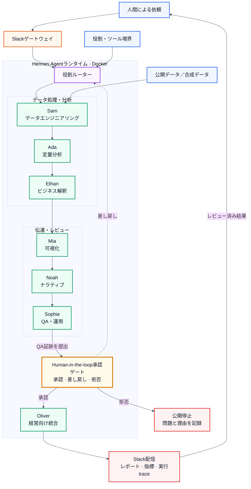

# Multi-Agent AI Analytics Office

**言語:** [English](README.md) | 日本語

[](https://github.com/Lee2379/multi-agent-ai-analytics-office/actions/workflows/ci.yml)


**Docker上の運用モデルにおいて、Hermes／SlackとSupabase／PostgreSQL、Obsidian／OhMyWikiを組み合わせ、調査、統制されたデータ運用、分析、レビュー、経営向け成果物の作成を役割別AIエージェントで実行する分析オフィスです。**

本リポジトリでは、混同されやすい二つの検証対象を明確に分離しています。

1. **運用証跡:** 一つの制約付きDocker環境で稼働し、Slack経由で実務タスクを処理する7つのHermes専門プロファイル。
2. **再現可能な評価:** 同一の役割境界を合成データ上で実行し、監査可能なtraceを生成してCIで継続的に検証する、外部依存のない決定論的Pythonハーネス。

認証情報、非公開メッセージ、メール／カレンダーデータ、Workspace識別子、個人のファイルパスは公開していません。掲載画像はprivacy-sanitized derivative、または変更不要と判断したlow-sensitivity captureです。private originalはリポジトリ外で管理しています。

## エグゼクティブサマリー

本プロトタイプは、汎用LLMランタイムを小規模な仮想分析組織へ再構成したものです。データエンジニアリング、定量分析、ビジネス解釈、可視化、ナラティブ作成、品質保証、最終統合の責任を各エージェントに割り当てています。各段階は自由形式のグループチャットではなく、名前付きartifactとtrace eventを出力します。

運用環境では、以下を確認しました。

- gatewayが稼働する7つの分離プロファイル
- 2 CPU・4 GiBメモリのDockerリソース制限
- 非特権`hermes`ユーザーでの実行
- 公開情報を用いた市場調査結果のSlack配信
- 調査、分析、プレゼンテーション作成、運用支援を含む役割別タスク
- source provenance、concept／relation構造、英語・日本語fact-check、source-linked 15ページ報告書を持つObsidianベースの市場調査workflow
- schema control、役割分離されたingestion、reconciliation、人間によるdata-quality判断、監査可能なSQL分析、定期orchestration、deploy済みBI dashboardを統合したSupabaseベースのdata-operations loop

公開リポジトリには、厳格なデータ検証、時間リークを防ぐholdout予測、artifact contract、QA gate、プライバシースキャン、テスト、オフラインで再現できるhardened containerを実装しています。

### 検証状況

| Control | Committed status |
|---|---:|
| Unit／integration tests | 12 / 12 passed |
| 決定論的reference artifacts | 6 / 6 matched |
| Reviewed evidence captures | 37 / 37 hashes verified |
| 内部documentation links | all local targets resolved |
| Hardened container smoke test | network disabled・read-only rootでpassed |

benchmark、test範囲、統計上の制約、release historyは[`docs/evaluation.md`](docs/evaluation.md)、[`docs/limitations.md`](docs/limitations.md)、[`CHANGELOG.md`](CHANGELOG.md)に記録しています。これらは公開engineering harnessとevidence controlを検証するものであり、非公開Hermes deploymentのproduction accuracyを主張するものではありません。

## 課題と設計目標

市場調査は、情報収集、データ検証、定量分析、解釈、可視化、文章化、レビューを一つのモデル応答に混在させがちです。その場合、誤りがどの工程で混入したのか、主張がどの証拠に基づくのか、独立した品質確認を通過したのかを追跡しにくくなります。

本システムは、次の5点を設計目標としました。

1. **役割分離:** 各専門家が限定された工程と明示的な出力契約を担当する。
2. **artifactによるhandoff:** 指標、chart、decision note、verdict、reportを非構造な会話履歴ではなく名前付き成果物として受け渡す。
3. **運用アクセス:** Slackを依頼・配信面とし、Hermes profileでidentity、policy、Skills、tool accessを分離する。
4. **fail-closed review:** データ、予測、chart、decision note、narrativeの検査がすべて通過した場合のみ最終レポートを生成する。
5. **非公開情報を出さない再現性:** 実運用環境は非公開のまま、合成データによる決定論的ハーネスで役割シーケンスと評価ロジックを再現する。

## 実装モデル

同一システムを、運用証跡と公開参照実装という二つの層で検証します。スクリーンショットはDocker・Slack上での実運用を示し、実行可能コードは分析契約、評価ロジック、QA gateの挙動を示します。両者を相互の代替とはみなさず、運用上のclaimと再現可能なengineering claimを明確に区別しています。

| 観点 | 実運用レイヤー | 公開参照レイヤー |
|---|---|---|
| Runtime | 制約付きDocker環境上のHermes Agent | Python 3.11+ package、hardened offline container |
| Entry point | profile gatewayへroutingされるSlack mention | `agentic-office run` CLI |
| 専門化 | identity、policy、Skills、Slack設定を分離した7 profiles | [`config/agents.json`](config/agents.json)の7つのmachine-readable contract |
| Data access | 承認済みprofile tools、Supabase Skill／MCP、任意の公開情報integration | 合成CSV、network・外部credentialなし |
| Coordination | 実運用では専門家へ直接routing | 評価用の決定論的7-stage artifact pipeline |
| Outputs | Slack調査レポートと業務成果物 | JSON metrics／trace、SVG chart、Slack payload preview、executive report |
| Verification | digest登録済みのprivacy-sanitized evidence | unit/integration tests、CI再生成、privacy scan、Docker build |

component構成、configuration boundary、request pathの詳細は[`docs/implementation.md`](docs/implementation.md)に記載しています。

## 運用証跡

以下はDocker profiles、Slack access control、`SOUL.md` role policy、Skills、MCP、Slack実務利用の証跡です。画像はprivacy-sanitized derivative、または変更不要と判断したlow-sensitivity captureであり、forensic originalとは扱いません。source artifactとの対応は[evidence register](docs/evidence/evidence-register.md)のSHA-256 digestで管理しています。

### Docker上のmulti-profile runtime


Hermes runtime上で7つの専門profileとgatewayが稼働している状態です。ローカルパスとアカウントavatarはマスキングし、自由記述の説明は公開可能な英語の役割名へ置換しています。


`hermes-docker`内部でread-only commandを実行し、credential値を表示せず設定の有無だけを確認しています。7 profileすべてでbot/app設定と明示的なuser allowlistが確認され、open accessは設定されていません。これはprofile別Slack設定の存在を示しますが、token値が相互に一意であることまでは証明しません。

### `SOUL.md`による役割・policy分離


各profileに`SOUL.md`が存在し、7ファイルすべてで異なるSHA-256 prefixを確認しています。digestはpolicy artifactの分離を支持しますが、runtimeでの強制をhashだけで証明するものではありません。公開可能なbehavioral contractは[`config/agents.json`](config/agents.json)に整理しています。


Oliverには戦略企画責任者兼researcherとして、一次情報に基づく市場調査とevidence-based decision supportを行うpersonaを設定しました。認証情報を含まない承認済み抜粋のみを公開し、policy全文、hidden instruction、他profileの本文は非公開としています。

### SkillsとMCP integration


第三者Skillをquarantineし、source provenanceを記録し、Hermes security scanと人間のconfirmationを経てOliver profileへ導入した過程です。`SAFE`は記録されたscan verdictであり、第三者codeの無リスクを保証するものではありません。


市場調査workflowで使用した外部data access surfaceです。credential値は不透明な白色maskで完全に覆っています。MCP設定の存在と、後述するSlack上の業務結果は別々の証拠として扱っています。

### Google Workspace capability discovery


設定済み環境でGWS Gmailのsend、triage、reply、read、watch commandと、任意のModel Armor sanitization parameterを確認しました。subcommandを指定しなかったため、画面はvalidation/help responseです。したがって、capability discoveryは確認できますが、OAuth認証やmailbox取得の成功までは主張しません。message contentやaccount identifierも表示していません。

### Slackでのmulti-agent実行

<table>
  <tr>
    <td width="44%"></td>
    <td width="56%"></td>
  </tr>
  <tr>
    <td><strong>Multi-agent availability.</strong> 一つの依頼から、共有Slack interface上の複数専門profileを呼び出せることを示します。</td>
    <td><strong>Business workload.</strong> 公開ranking snapshotを基に、価格、割引、rating、review aggregateを含む調査結果を配信しています。</td>
  </tr>
</table>


Oliverは公開情報を用いた市場調査、Miaはrole-specific Skillsとtoolsを用いたpresentation作成を担当しています。これは実務で複数profileを使い分けた証拠ですが、自律的なagent-to-agent delegationを示すものではありません。

### 監査可能な小売分析に向けたリードエージェントの計画

<table>
  <tr>
    <td width="58%"></td>
    <td width="42%"></td>
  </tr>
  <tr>
    <td><strong>境界を明示した依頼。</strong> 在庫切れと過剰在庫を抑えながら販売実績を維持する、という経営判断を起点に、scope、KPI、assumption、役割分担、acceptance criteria、handoffを要求しています。datasetの性質を創作せず、不明情報を<code>Not Verified</code>とする制約も明示しました。</td>
    <td><strong>artifactを生成する実行。</strong> Oliverはlive tool surfaceから小売inputと既存project artifactsを確認し、9項目のcharterを名前付きMarkdown artifactとして保存しています。これは計画とfile-backed executionを支持しますが、後続する全specialistの完了まではこの2枚だけでは証明しません。</td>
  </tr>
</table>

この証跡により、単なるprofile availabilityではなく、リードエージェントがbusiness problemをSam、Ada、Ethan、Mia、Noah、Sophie向けのartifact contractへ変換した実務stageを確認できます。公開reference pipelineは同じ役割境界を決定論的に実装しており、今後のlive-stage証跡もobserved executionとmodeled orchestrationを区別したまま追加できます。詳細なclaim boundaryは[`docs/evidence/retail-analysis-charter.md`](docs/evidence/retail-analysis-charter.md)に記載しています。

### AIエージェントによるデザインシステム資料作成

<table>
  <tr>
    <td width="52%"></td>
    <td width="48%"></td>
  </tr>
  <tr>
    <td><strong>仕様からtool executionへ。</strong> Slack上でMiaに対し、profile内の<code>DESIGN.md</code>を基に、color palette、typography、UI componentsを含むCanva presentationを作成するよう依頼しています。表示されたtraceでは、design、design-system、computer-use、PowerPoint Skillsの読込み、source specificationの参照、artifact書込み、利用可能なpresentation toolchainの確認まで追跡できます。</td>
    <td><strong>レビュー可能な成果物。</strong> 結果画面には<code>MAGMA_Design_System_v1.pdf</code>と、version、system name、description、color tokenを含む構造化source specificationが表示されています。これにより、限定された依頼がchat responseだけで終わらず、具体的なpresentation artifactへつながったことを確認できます。</td>
  </tr>
</table>

依頼者の説明では、このworkflowでCanva APIを使用しています。公開captureから確認できるのは、Canva向けの依頼、agentのSkill/tool trace、生成されたPDF previewまでです。Canva APIのrequest/response log、asset identifier、export logは表示されていないため、API call自体は公開証跡上で**Not independently verified**と分類しています。また、全slideの内容精度、accessibility、visual QAはこの2枚のcaptureの検証範囲外です。

### Obsidian／OhMyWikiを用いた市場インテリジェンス自動化

この実運用ケースでは、エージェントの処理をchat responseで終わらせず、レビュー可能なknowledge pipelineへ拡張しました。公開調査ページをsource URI付きMarkdownとしてObsidian vaultに保存し、OliverからOhMyWiki（OMW）のlibrarian workflowを呼び出して、provenance、confidence、relationを持つentity／concept候補へ構造化します。複数のraw sourceとconceptをsynthesisした後、英語・日本語のfact-checkを実行し、source-linked presentationへ変換します。

<table>
  <tr>
    <td width="50%"></td>
    <td width="50%"></td>
  </tr>
  <tr>
    <td><strong>File-backed ingestion.</strong> 公開source URIと抽出テキストを日付付きraw noteとして保持し、chat historyだけに依存しません。</td>
    <td><strong>Knowledge modeling.</strong> factとinterpretationを分離し、sourceとrelationを追跡可能なfieldとして公開します。</td>
  </tr>
  <tr>
    <td width="50%"></td>
    <td width="50%"></td>
  </tr>
  <tr>
    <td><strong>Evidence-linked synthesis.</strong> draft status、confidence、provenanceを隠さず、複数のraw noteとconceptを統合します。</td>
    <td><strong>English analytical review.</strong> 正しく出典帰属された数値と、未検証の戦略仮説を分離します。</td>
  </tr>
  <tr>
    <td width="50%"></td>
    <td width="50%"></td>
  </tr>
  <tr>
    <td><strong>Multilingual review.</strong> 日本語版でも、結論だけを翻訳せず、出典帰属、confidence、未検証仮説を保持します。</td>
    <td><strong>Decision delivery.</strong> レビュー済みcorpusをconfidence mapとsource appendixを含む15ページのPDFへ変換します。</td>
  </tr>
</table>


**日本語によるclaim単位の修正。** このreport sectionでは、引用された根拠が30代男性に関する結論を直接支持するかを検証しています。確認済みの人口統計とsegment別利用signalは維持する一方、広すぎる主張を「直接根拠は断片的であり、価格・品揃え・channelの意思決定には不十分」と修正しています。提案事項には明示的に`[unverified]`を付け、表示されたsource registerによってreviewの追跡可能性を保っています。このcaptureが示すのはreview構造と出力された結論であり、基礎となるsource分析を独立に再実行した証拠ではありません。

表示されたlibrarian traceでは、重複taskを抑止し、既存成果として9件のproposed entity pageと7件のproposed concept pageを報告しています。また、fact・interpretation・open questionを分離し、英語・韓国語・日本語でcorrection recommendationを生成しています。これらのcaptureはartifact-backed executionとreview behaviorを示しますが、全sourceの正確性、graph clustering実装、全slideの計算を独立に検証するものではありません。

読者向け成果物: [英語executive report — Men's Fashion Market in the 30s Segment](docs/case-studies/thirtysomething-mens-fashion-market-report.md)。

workflow、画像別supported claim、検証境界の詳細: [Obsidian-backed knowledge automation](docs/evidence/obsidian-knowledge-automation.md)。

### Supabaseを基盤とするエージェント型データ運用

本ケースでは、分析オフィスをgoverned database workflowへ拡張しました。Oliverが承認済みsourceからデータを収集し、EthanがCSV contractを検証してstagingへ格納し、Samが制御されたloadとreconciliationを実行します。AdaはSupabase MCPを介してread-onlyの品質検査とSQL分析を行います。別の定期reporting loopでは、分析、report draft、公開を別々のKanban cardへ割り当て、未検証の結果を公開せずapproval gateで停止します。

#### 1. Schema contractと永続化されたrecord

<p align="center"><a href="assets/evidence/28-ada-supabase-schema-review.png"></a></p>

**Schema-aware agent access.** Adaが設定済みSupabase capabilityを通じてsnapshotの粒度とappend-only ruleを解釈します。

<p align="center"><a href="assets/evidence/31-supabase-loaded-records-sanitized.png"></a></p>

**Materialized data.** run ID、source identifier、URL、product attribute、provenanceをdatabaseに保持します。

#### 2. Reconciliationと監査可能なSQL

<p align="center"><a href="assets/evidence/32-supabase-load-reconciliation-sanitized.png"></a></p>

**Load verification.** 5つのstaging tableについて、54,690行・113 batchの件数がすべて一致しました。曖昧なduplicate candidateは自動削除せず、人間へescalateします。

<p align="center"><a href="assets/evidence/34-agent-sql-analysis.png"></a></p>

**Auditable analysis.** channel別指標と、その計算に使用したSQLを同時に返します。

#### 3. Orchestrationと共有delivery

<p align="center"><a href="assets/evidence/36-multi-agent-kanban-loop.png"></a></p>

**Closed-loop operations.** 固定artifact contract、順序付きcard、定期実行、failure／approval escalationによってhandoffを可視化します。

<p align="center"><a href="assets/evidence/35-deployed-bi-dashboard.png"></a></p>

**Shared delivery.** 承認済みaggregateをagent session内に残さず、共同閲覧可能なdashboardとして公開します。

本証跡が示すのは定期batch automationであり、streaming処理ではありません。schema control、件数reconciliation、人間が判断すべきdata-quality issue、SQL結果、task boundary、制約事項は[Supabase-backed agent data operations case study](docs/case-studies/supabase-agent-data-operations.md)に記載しています。

詳細な証跡とclaim boundary: [Docker/Slack isolation](docs/evidence/docker-slack-isolation.md)、[`SOUL.md` policy files](docs/evidence/soul-policy-files.md)、[Skills supply chain](docs/evidence/skills-supply-chain.md)、[MCP integration](docs/evidence/mcp-integration.md)、[Google Workspace integration](docs/evidence/google-workspace-integration.md)、[multi-agent Slack](docs/evidence/multi-agent-slack.md)、[retail analysis charter](docs/evidence/retail-analysis-charter.md)、[design-system presentation](docs/evidence/design-system-presentation.md)、[Obsidian-backed knowledge automation](docs/evidence/obsidian-knowledge-automation.md)、[Supabase-backed agent data operations](docs/case-studies/supabase-agent-data-operations.md)、[runtime metadata](docs/evidence/runtime-evidence.md)、[live workload](docs/evidence/live-workload.md)。

## アーキテクチャ



Human-in-the-loopの承認ゲートは、QAと最終統合の間に配置しています。Sophieが根拠資料と統制判定を提出し、人間のレビュー担当者が、成果物の承認、役割ルーターへの差し戻し、または理由を記録した公開拒否のいずれかを選択します。Oliverによる経営向け統合とSlack配信へ進めるのは、承認された経路だけです。公開offline harnessでは人間の判断を自動化したとはみなさず、非公開のSlack情報やLLM認証情報がなくても契約と評価ロジックを確認できるよう、この境界を決定論的なblocking gateとして再現しています。

### リクエスト経路

実運用経路と公開評価経路は同じ役割モデルを共有しますが、それぞれ異なる検証目的を持ちます。

**実運用における専門プロファイル経路**

1. 利用者がSlack上で担当する専門エージェントをmentionします。
2. 対象プロファイルのgatewayがeventを受信し、プロファイル単位の設定を適用します。
3. `SOUL.md`が非公開の役割policyを定義し、導入済みSkillが再利用可能な手順と許可されたtool利用を規定します。
4. 外部の公開データが必要な場合、専門エージェントは承認済みMCP integrationを利用できます。
5. 専門エージェントが成果物を依頼元のSlack threadへ返します。

**公開評価経路**

1. CLIが合成商品データと時系列売上データを読み込みます。
2. Samが分析開始前にschema、値、unique性、並び順を検証します。
3. Adaが記述統計を計算し、training windowだけを用いて解釈可能なtrendをfitします。
4. Ethan、Mia、Noahが承認済みartifactからdecision note、可搬性のあるchart、narrativeをそれぞれ作成します。
5. Sophieが必須controlを評価し、QA証跡をreview gateへ提出します。
6. 実運用workflowでは、人間のレビュー担当者が承認、修正依頼、または公開拒否を選択します。公開harnessでは、非対話型CIの再現性を保つため、このcheckpointを決定論的なpass/fail gateとして実装しています。
7. Oliverは承認またはpassした経路でのみreportとSlack payload previewを出力し、harnessは全agent stageを`trace.json`へ記録します。

実運用prototypeについて、自律的なagent間delegationを実証したとは主張しません。専門プロファイルへの直接routingは運用証跡で確認し、公開の逐次pipelineは意図したhandoffを検査できる評価モデルとして提供しています。

### Hermesランタイムの構成要素

| Primitive | 実運用での機能 | 公開repositoryでの表現 |
|---|---|---|
| Profile | shared runtime内で専門家identityとprofile単位の設定・状態を保持 | [`config/agents.json`](config/agents.json)のagent名、role、input、output、reviewer |
| `SOUL.md` | 非公開persona、mission、decision boundary、response policyを定義 | 異なるfile digest、公開承認済みexcerpt 1件、非機密behavioral contract。全文は非公開 |
| Skill | 再利用可能な手順とtool instructionをpackage化 | sanitized installation evidenceとdocument化したsupply-chain boundary |
| MCP integration | 承認済みprofileへ外部data／tool adapterを提供 | tokenを完全maskした設定証跡と、別のSlack result capture |
| Slack gateway | 業務interfaceで依頼を受信しprofile responseを返却 | sanitized multi-profile／workload screenshot |
| Docker boundary | bounded compute、非公開service port、Docker socket未mountのshared Hermes runtimeをhost | secret-free deployment noteとoffline hardened Compose設定 |

この分離は意図的です。configuration presence、policy hash、screenshotは限定した運用claimを支え、公開codeとtestは再現可能なengineering claimを支えます。

## エージェント契約

| Agent | 責任 | 必須出力 | Guardrail |
|---|---|---|---|
| Sam | data load・validation | data-quality summary | invalid／duplicate recordで停止 |
| Ada | market・forecast metric計算 | quantitative metrics | 計算根拠のないbusiness claimを禁止 |
| Ethan | metricをbusiness implicationへ変換 | decision notes | observationとrecommendationを分離 |
| Mia | 分析結果の可視化 | portable SVG chart | 承認済みaggregate metricのみ参照 |
| Noah | 簡潔なnarrative作成 | draft summary | 数値と不確実性を保持 |
| Sophie | 完全性・整合性検査 | QA verdict | 必須artifact失敗時にfinalizationをblock |
| Oliver | decision memo統合 | executive report | reviewed artifactのみ利用 |

Machine-readable contractは[`config/agents.json`](config/agents.json)にあります。同じregistryをCLI packageに含め、runtimeで各trace eventのrole、objective、input、output、reviewerを設定します。test suiteでは公開copyとの完全一致を確認し、documentationとexecutionのdriftを検出します。

## 再現可能なdemo

合成product dataとdaily sales dataを使用し、schema・値域に加えてcanonical ISO dateと連続したdaily cadenceを検証します。その後、descriptive metric、training windowのみでのlinear trend fitting、chronological holdout評価、7日予測、7つのagent contractによるartifact処理を実行します。

```bash
python -m venv .venv
source .venv/bin/activate
python -m pip install -e .
agentic-office run \
  --products data/sample_products.csv \
  --sales data/sample_sales.csv \
  --output artifacts/local_run
```

Windows PowerShell:

```powershell
.venv\Scripts\Activate.ps1
```

生成物:

```text
artifacts/local_run/
├── executive_report.md
├── forecast.svg
├── metrics.json
├── run_manifest.json
├── slack_payload.json
└── trace.json
```

`run_manifest.json`にはpackage version、content-derived run ID、2つのCSV input、実行したagent-contract registry、および全生成artifactの正規化SHA-256 digestを記録します。local filesystem pathやtimestampを含めないため、reference runはOSをまたいで決定論的に検証できます。

Hardened offline demo:

```bash
docker compose up --build --abort-on-container-exit
```

containerはnon-rootで実行し、Linux capabilitiesをすべてdropし、`no-new-privileges`、read-only root filesystem、network dependencyなしで構成しています。書込み可能なのは宣言済みの`/output` volumeだけです。Python base imageはdigestでpinし、CIでも同じhardening flagでcontainer smoke testを実行します。

## 評価とquality gate

```bash
python -m unittest discover -s tests -v
python scripts/privacy_scan.py .
python scripts/verify_markdown_links.py

agentic-office run \
  --products data/sample_products.csv \
  --sales data/sample_sales.csv \
  --output artifacts/ci_run
python scripts/verify_reference_artifacts.py
```

CIはschema／data-quality rejection、7 agent contractのschemaとpublic/package drift、canonical dateとdaily cadence、chronological train/holdout separation、zero actual時のMAPE未定義処理、決定論的forecast・report、7 role stages、QA gate、6つのreference artifactの完全一致、内部document link、digest-pinned containerのhardened smoke run、credential／個人path／private network address／email addressの非混入を検証します。

現在の決定論的benchmark resultは[`docs/evaluation.md`](docs/evaluation.md)に記録しています。[`artifacts/sample_run`](artifacts/sample_run)のcommitted outputはCIで再生成し、完全一致を検証します。

### Reference benchmark

| 検証項目 | Committed result |
|---|---:|
| 有効な合成product records | 15 |
| Chronological sales observations | 35日 |
| Training / holdout split | 28 / 7日 |
| Holdout MAE | 2.3831 units |
| Holdout RMSE | 2.7670 units |
| Holdout MAPE | 6.9532% |
| MAPEに使用した非ゼロactual | 7 / 7 |
| 7日間の予測需要 | 約274 units |
| Workflow / QA status | 7/7 stages、passed |

これらは公開harnessのregression fixtureであり、production performanceの主張ではありません。小規模な合成データによりdata contract、時間分離、artifact生成、決定論的再生成を検証しますが、一般的な予測精度を推定するものではありません。

## Engineering上の判断とtrade-off

- **決定論的な公開harness:** model callやnetwork requestなしで再現可能。ただし非公開LLM reasoning自体は再現しない。
- **逐次的な公開orchestration:** handoffを検査・test可能にする一方、実運用では必要な専門家へ直接routingできる。
- **chronological evaluation:** 最後の7 observationsをholdoutとし、fittingから除外してtemporal leakageを防止。slopeをunits/dayとして扱うためcanonical ISO dateと連続daily cadenceを必須とし、MAPEは非ゼロactualだけで計算して対象がなければ未定義とする。linear trendは解釈可能性を優先し、seasonality、promotion、causal effectは扱わない。
- **content-addressed provenance:** 決定論的manifestがinput／output digestとpackage version 1.1.0を結び付け、machine-specific pathを公開せずにstaleまたは改変されたreference artifactを検出する。
- **非公開の運用状態:** credential、raw Slack history、`SOUL.md`全文、session、原本画像はGit外で管理するため、公開claimはsanitized evidenceとdigestの範囲に限定する。
- **free-form coordinationよりartifact contract:** traceabilityを高める代わりにworkflowの柔軟性を制限する。
- **upstream runtime boundary:** Hermesはthird-party runtimeとして利用し、本リポジトリはconfiguration、orchestration、evaluation、evidence methodologyを所有する。

## プライバシーを保護する証拠公開方針

raw screenshotにはWorkspace label、display name、local path、application ID、非公開の運用情報が含まれ得ます。公開している37件のprivacy-reviewed public captureは、匿名化した派生画像と、内容編集を行わず公開を承認した低機密度captureで構成されています。redactionが必要な場合はblurではなくopaque maskを使用し、全画像のSHA-256 digestを[`docs/evidence/evidence-register.md`](docs/evidence/evidence-register.md)に記録しています。

提供画像の一つではURL内にauthentication tokenが露出していました。公開版ではcredential値全体を不透明な白色maskで覆い、原本をrepositoryとevidence chainから除外しています。マスキングは漏洩credentialを無効化しないため、失効・再発行は別途必要です。

## 貢献範囲

本プロジェクトはHermes Agent、Slack、外部data access serviceの実装を自作したとは主張しません。Open-sourceの[Hermes Agent](https://github.com/NousResearch/hermes-agent)をruntimeとして利用し、私が設計・実装した範囲はrole design、profile deployment、Docker operation、Slack workflow、決定論的evaluation harness、evidence methodology、privacy control、portfolio documentationです。

Hermes upstream source codeは本リポジトリに再配布していません。

## リポジトリ構成

```text
config/                  役割contract
data/                    個人情報を含まない合成demo data
deployment/hermes/       secret-free deployment notes / templates
docs/                    architecture、evaluation、limitations、evidence
assets/evidence/         privacy-sanitized operational screenshots
scripts/                 runtime evidence collector / privacy scanner
src/                     決定論的analytics / orchestration harness
tests/                   unit / integration tests
artifacts/sample_run/    再現可能なreference output
```

## 制約事項

- 公開harnessは決定論的でLLMを呼び出さず、private model credentialを公開せずにorchestration boundaryを評価します。
- live market scanは一時点の公開ranking snapshotであり、市場全体を統計的に代表しません。
- 公開画像はsanitized derivativeでありforensic originalではありません。private originalは管理されたinterview reviewに限り確認できます。
- role sequenceは評価済みですが、single-agent baselineとの比較実験は今後の課題です。
- 実運用imageは変動する`latest` tagからdeployされました。productionではimmutable image digestをpinすべきです。

## ライセンス

本リポジトリのoriginal codeとdocumentationは[MIT License](LICENSE)で公開しています。第三者製品・商標の権利は各所有者に帰属します。
